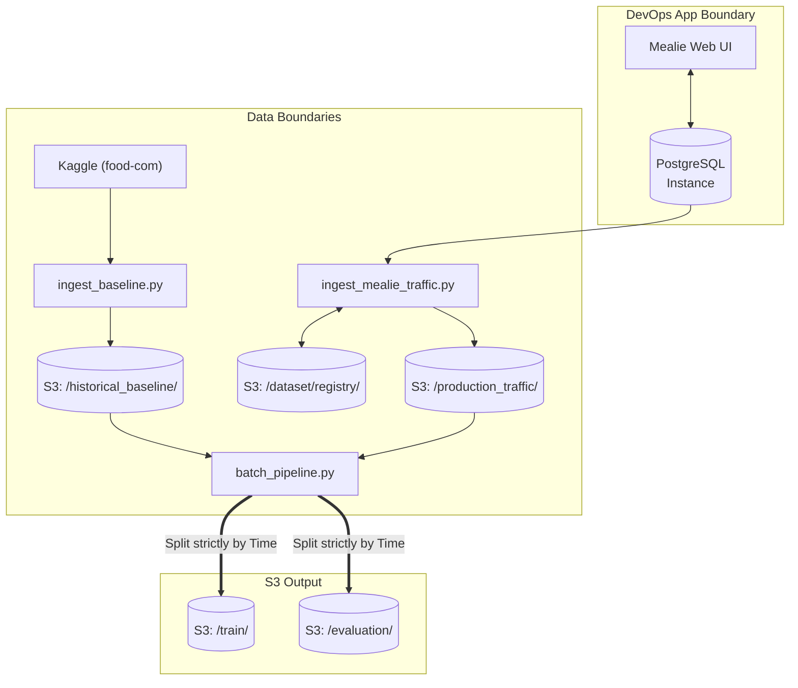

# Mealie ML Feature: Data Design & Architecture

This repository contains the Data Integration system for linking Mealie to an offline Graph Neural Network (GraphSAGE) recommendation system.

## 1. Components & Automated Workflow
The data components are built to be robust, fully dockerized, and automated via standard Docker Compose workflows.
- `ingest_baseline.py`: Fetches the raw `food-com-recipes-and-user-interactions` from Kaggle, applies ingestion evaluation checks, formatting logic, handles <5GB synthetic expansion, and writes to Chameleon Object Store as our **Historical Baseline**.
- `ingest_mealie_traffic.py` (Traffic Poller): Connects directly to the live PostgreSQL Mealie Database to sync real human usage. Automatically translates Mealie UUIDs to ML sequential Integers via our S3 Registry State Machine, and pushes to `production_traffic/`.
- `batch_pipeline.py`: Offline sync. Merges baseline and exact production traffic data, mathematically verifies split logic to prevent data leakage across train and eval sets, validates distribution qualities, and stages the splits for the Training member.
- `online_features.py` : Invoked real-time by the Serving layer to gather metrics representing user contexts in production.

*(Note: `generator.py` is safely preserved strictly as a legacy emulator script.)*

## 2. Schema Alignment & S3 ID Translation Registry

To seamlessly synchronize Kaggle's pure integer schemas with Mealie's UUID-heavy application schema and the strict Inference API protocol:
- Datasets convert `user_id` to prefixed string format (`"user:38094"`).
- Our Traffic Poller retrieves a global state map `id_mapping_registry.parquet` from S3. New Mealie interactions are cross-referenced, retaining memory of Old Kaggle items while safely mutating brand new interaction UUIDs into strictly typed ML Integer ID representations.

### Data Flow Diagram



## 3. Data Versioning

Our Chameleon object storage (`ObjStore_proj14`) applies versioning folders structurally:
- Baseline: Immutable at `dataset/historical_baseline/RAW_interactions.parquet`
- Traffic: `production_traffic/YYYYMMDD_HHMM/batch.parquet`
- Offline Target: `train/YYYYMMDD_HHMM/train.parquet`

## 4. Evaluation and Monitoring Strategy
1. **At Ingestion**: Real-time evaluation detecting missing core columns (`user_id`, `recipe_id`, `rating`) or unapproved scale ranges.
2. **Prior to Model Release**: Evaluates `Candidate Quality` by auditing node sparsity prior to split upload, and asserts absolute isolation between training and evaluation dataset timestamps (Leakage Prevention).
3. **Inference Metrics Logging**: Caches queries generated by `online_features.py` back into `monitoring/` bucket on S3 to assess Data Drift and average input properties.

## 5. Execution Tutorial (Chameleon VM Quickstart)

If you have just launched a fresh Chameleon Ubuntu VM, follow these exact steps to launch the entire Mealie app, PostgreSQL, baseline ingestion, and the periodic scheduling queues **all dynamically integrated**.

### Step 1: Configure Credentials
```bash
# Setup AWS/Object Store credentials in a .env file
cp .env.template .env
# Edit the .env to insert your S3 keys:
nano .env 
```

### Step 2: One-Command Execution!
We have fully automated the entire microservice lifecycle (Web UI, Data DB, Baseline Scripts, Poller, and Batch pipeline) via Docker Compose. Run this single command from within the `data_pipeline/` directory:

```bash
docker compose up --build -d
```

### What happens now?
- **Port 9000** on your Chameleon VM will now correctly serve your real live Mealie Application.
- **Port 5432** serves the persistent Postgres database locally.
- A background `ingest` container immediately runs to grab the baseline from Kaggle and deposits it to S3, then peacefully exits.
- A background `traffic-poller` wakes up and constantly crawls PostgreSQL for updates, translating UUIDs.
- A background `batch` processor runs fully automated cycles every 1 hour to output splits.
