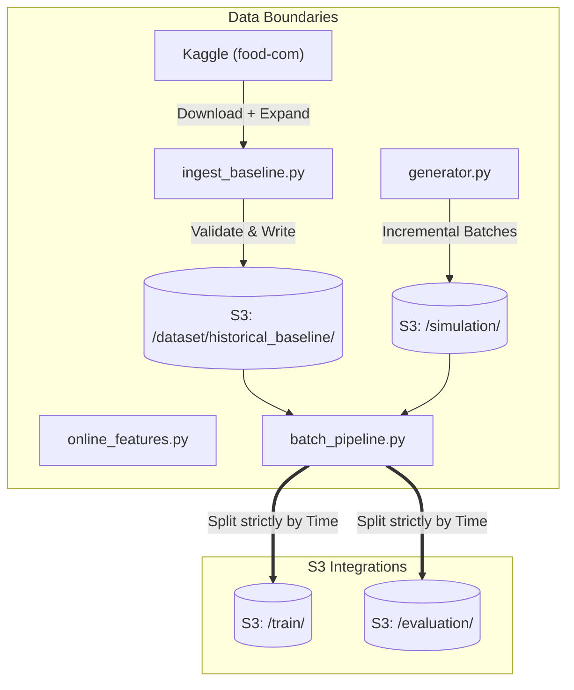

# Mealie ML Feature: Data Design & Architecture

This repository contains the Data Integration system for linking Mealie to an offline Graph Neural Network (GraphSAGE) recommendation system.

## 1. Components & Automated Workflow
The data components are built to be robust, fully dockerized, and automated via standard CLI commands.
- `ingest_baseline.py` (`make ingest-baseline`): Fetches the raw `food-com-recipes-and-user-interactions` from Kaggle, applies ingestion evaluation checks, formatting logic, handles <5GB synthetic expansion, and writes to Chameleon Object Store as our **Historical Baseline**.
- `generator.py` (`make run-generator`): Simulates continuous traffic by logging incremental JSON events mapping exactly to Mealie's webhook schema towards S3 object store.
- `batch_pipeline.py` (`make run-batch`): Offline sync. Merges baseline and simulation data, mathematically verifies split logic to prevent data leakage across train and eval sets, validates distribution qualities, and stages the splits for the Training member.
- `online_features.py` : Invoked real-time by the Serving layer to gather metrics representing user contexts in production.

## 2. Schema Alignment

To seamlessly synchronize Kaggle's pure integer schemas with Mealie's UUID-heavy application schema and the strict Inference API protocol:
- Datasets convert `user_id` to prefixed string format (`"user:38094"`).
- Synthetic event pipelines map field shapes to standard Mealie interactions.

### Data Flow Diagram



## 3. Data Versioning

Our Chameleon object storage (`ObjStore_proj14`) applies versioning folders structurally:
- Baseline: Immutable at `dataset/historical_baseline/interactions.csv`
- Simulations: `simulation/YYYYMMDD_HHMM/batch.json`
- Offline Target: `train/YYYYMMDD_HHMM/train.csv`

## 4. Evaluation and Monitoring Strategy
1. **At Ingestion**: Real-time evaluation detecting missing core columns (`user_id`, `recipe_id`, `rating`) or unapproved scale ranges.
2. **Prior to Model Release**: Evaluates `Candidate Quality` by auditing node sparsity prior to split upload, and asserts absolute isolation between training and evaluation dataset timestamps (Leakage Prevention).
3. **Inference Metrics Logging**: Caches queries generated by `online_features.py` back into `monitoring/` bucket on S3 to assess Data Drift and average input properties.

## 5. Execution Tutorial (Chameleon VM Quickstart)

If you have just launched a fresh Chameleon Ubuntu VM, follow these exact steps to run and test the complete pipeline.

### Step 1: Clone & Configure Credentials
First, setup your Object Storage env variables and optional dataset URL inside your VM.
```bash
# Setup AWS/Object Store credentials in a .env file
cat <<EOF > data/.env
# Optional: Override the fallback default download Kaggle ZIP link via Curl
DATASET_URL=https://www.kaggle.com/api/v1/datasets/download/shuyangli94/food-com-recipes-and-user-interactions

# Required: S3 Auth
AWS_ACCESS_KEY_ID=YOUR_AWS_ACCESS_KEY_HERE
AWS_SECRET_ACCESS_KEY=YOUR_AWS_SECRET_KEY_HERE
AWS_ENDPOINT_URL=https://chi.tacc.chameleoncloud.org:7480
S3_BUCKET_NAME=ObjStore_proj14
BATCH_INTERVAL=3600
EOF
```

### Step 2: Build the Main Container
Inside the `/data` folder, build the automation environment:
```bash
cd data/
docker build -t mealie-data .
```

### Step 3: Run the Tests & Pipeline

**Test 1: Run the Kaggle Ingestion (Seed Historical Data)**
This downloads the data to your VM, validates the schema (raising alerts if data quality fails), formats it to match Mealie, and uploads it to S3.
```bash
docker run --rm --env-file .env mealie-data ingest-baseline
```
*Success criteria: Console prints `✅ Baseline Ingestion COMPLETE.`*

**Test 2: Simulate Live Web Application Traffic (Generator)**
Starts creating synthetic logs representing new users interacting with recipes.
```bash
docker run --rm --env-file .env mealie-data run-generator
```
*Success criteria: Console repeatedly prints `Uploading simulation batch...` for a minute.*

**Test 3: Compute the Offline Training Sync (Batch Pipeline)**
Merges the Kaggle baseline from Step 1 with the simulated weblogs from Step 2, evaluates for data leakage, and outputs the `/train` & `/eval` splits to the S3 bucket.
```bash
docker run --rm --env-file .env mealie-data run-batch
```
*Success criteria: Prints `✅ Leakage Prevention Verified: Train timestamps strictly before Eval timestamps.` and saves the splits successfully to Object storage.*

**Test 4: Serving System Inference Test (Online Features)**
Tests the exact payload expected by the Serving Layer directly against the `online_features.py` module.
```bash
docker run --rm --env-file .env --entrypoint python mealie-data online_features.py
```
*Success criteria: Outputs a strictly typed JSON payload responding to `{"user_id": "user:13751"}` and silently logs the query metrics to S3 `monitoring` for drift tracking.*
