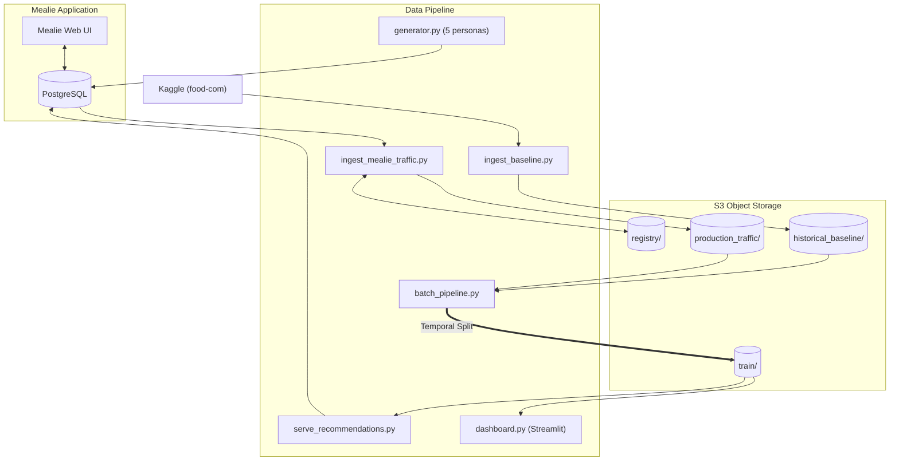

# Mealie ML Feature: Data Design & Architecture

This repository contains the Data Integration system for linking Mealie to an offline Graph Neural Network (GraphSAGE) recommendation system.

## 1. Components & Automated Workflow

All components are fully dockerized and orchestrated via a single `docker compose up --build -d`.

| Script | Purpose |
|--------|---------|
| `ingest_baseline.py` | Fetches Kaggle `food-com` dataset, validates schema, expands with synthetic data generation (popularity-weighted new interactions, no data leakage), uploads to S3 |
| `seed_mealie_recipes.py` | Seeds Mealie with real recipes from the Kaggle dataset |
| `generator.py` | Simulates 5 user personas with distinct behavior profiles (ratings, favorites, meal plans) via Mealie's per-user API endpoints |
| `ingest_mealie_traffic.py` | Polls PostgreSQL for user interactions (ratings + favorites + meal plans), maps Mealie UUIDs to ML integer IDs via S3 Registry |
| `batch_pipeline.py` | Merges baseline + production traffic, applies temporal splits to prevent data leakage, stages versioned datasets for Training |
| `serve_recommendations.py` | Runs GNN inference per-user and injects personalized `🤖 For {username}` tags into Mealie's database |
| `dashboard.py` | Streamlit dashboard showing per-user recommendations with normalized confidence scores and live interaction counts |
| `online_features.py` | Real-time feature computation for the Serving layer |
| `orchestrator.sh` | Daemon loop: runs ingest → batch → retrain trigger → tag refresh every 5 minutes |

## 2. User Simulation (5 Personas)

The traffic generator creates 5 diverse user personas via Mealie's invitation token flow:

| Persona | Behavior | Activity |
|---------|----------|----------|
| Comfort Food Lover | Rates high (4-5), prefers comfort food | High |
| Health Nut | Strict rater (2-3), prefers healthy recipes | Medium |
| Adventurous Eater | Tries everything, no preference filter | Very high |
| Casual Browser | Rates around 3-4, prefers simple recipes | Low |
| Weekend Warrior | Plans meals heavily, mostly positive ratings | Low base, weekend spikes |

Interactions use correct per-user Mealie APIs:
- `POST /api/users/{id}/ratings/{slug}` — records ratings to `users_to_recipes`
- `POST /api/users/{id}/favorites/{slug}` — records favorites to `users_to_recipes`
- `POST /api/households/mealplans` — records meal plans to `group_meal_plans`

## 3. Synthetic Data Expansion

For datasets < 5GB, `ingest_baseline.py` expands data following best practices:
1. **Popularity-weighted sampling**: Users and recipes sampled proportional to activity
2. **Unique pairs only**: Skips any (user, recipe) pair that already exists
3. **Gaussian noise on ratings**: Blends user mean + recipe mean + N(0, 0.8)
4. **No data leakage**: Synthetic dates stay within the original data range

## 4. Schema Alignment & S3 ID Translation Registry

Seamlessly synchronizes Kaggle integer IDs with Mealie UUIDs:
- `id_mapping_registry.parquet` on S3 maintains the global state map
- New Mealie interactions are cross-referenced and assigned sequential ML integer IDs
- Cold-start users are hash-distributed across existing Kaggle user nodes for diverse recommendations

### Data Flow Diagram



## 5. Personalized Recommendations

Two surfaces display per-user GNN recommendations:
- **Mealie UI**: Each user gets a `🤖 For {name}` tag containing their top 7 recommended recipes
- **Streamlit Dashboard** (port 8501): Shows all users with interaction counts, recipe names, and 0-100% confidence scores

Both surfaces refresh every daemon cycle (5 min for tags, 30 min model TTL for dashboard).

## 6. Automation & Retrain Trigger

The daemon loop (`orchestrator.sh`) runs continuously:
1. Polls Mealie for new interactions (every 5 min)
2. Compiles versioned training batches to S3 (every 5 min)
3. Creates `retrain_trigger_*.json` on S3 (every 12 hours) for the Training Node
4. Refreshes Mealie AI tags with latest per-user recommendations (every 5 min)

## 7. Execution

```bash
cd data_pipeline
cp .env.example .env   # edit with real credentials
docker compose up --build -d
```

- **Port 9000**: Mealie UI
- **Port 8501**: Recommendation Dashboard
- **Port 5432**: PostgreSQL
